# Shesha Claude Designer

## Overview

**The conductor for design → on-brand Shesha app.** It does not author form JSON or pick colours — it ingests a design, turns each screen into a **measured layout blueprint**, plans the screens, and delegates: structure to `shesha-form-edit`, styling to `shesha-design-system`, and the placement comprehension + verification to `shesha-design-comprehension`. Its job is to make sure the built app *matches the design* — in layout (measured, not eyeballed) and in brand.

```dot
digraph { rankdir=LR;
  d [label="Claude design\n(source)"];
  ingest [label="1 ingest +\ntier detect"];
  comp [label="2 comprehend\n→ blueprints"];
  plan [label="3 plan screens"];
  build [label="4 build (form-edit)\n+ style (design-system)"];
  verify [label="5 verify:\nstructure · PLACEMENT · visual"];
  d -> ingest -> comp -> plan -> build -> verify;
  verify -> build [label="placement/visual\nmismatch → fix"];
}
```



## When to use

- **A design source exists** (prototype / kit / screenshots / runnable app) and the goal is to realise it in Shesha across one or more screens.
- **No design source, but the result has to look designed** — a prose brief naming several screens ("a 3-page flight booking system"), or any request carrying design intent ("make it look properly designed", "not default AntD"). This is a first-class path, not a fallback: see Step 1b.
- **Not** for "add a field to this form" (use `shesha-form-edit`) or "just theme this working form" (use `shesha-design-system`).

### Step R — route before paying for the pipeline

**Preference order (STRICT): form-configuration > new-component-then-form-configuration > custom-page.** Custom pages are the last resort — see the "Preference order" callout below the table.

| Task shape | Route |
|---|---|
| **Single canonical CRUD screen** — a table, a list-of-cards, a create-in-modal form, a details view, or a row-template mini-card ("a Patients table", "a Booking details view", "an Add Patient form") | **`Skill(shesha-developer:create-crud-form)` directly, and stop.** These five archetypes are covered byte-exact by one of six sample seeds; the trimmed CRUD skill is faster and higher-accuracy than the full pipeline for a lone screen. |
| Single non-canonical Shesha-form screen — a field-level edit, a bespoke form-designer page, a wizard step ("add a checkbox to X", "wire this button", "build a KPI form-designer tile") | Hand the whole task to `Skill(shesha-developer:shesha-form-edit)` and stop. Conducting a one-screen edit is pure overhead. |
| **Form-designer is missing ONE component** the screen needs (a specific chart, a rating input, an image annotator, a bespoke calendar) — the rest of the screen would be a normal form-config | **`Skill(shesha-developer:create-custom-component)` first** to add the component to the designer toolbox, then invoke `Skill(shesha-developer:shesha-form-edit)` to build the form-config using the new component. Stay on the form-configuration road. |
| **LAST RESORT — Single bespoke React/AntD page** — the screen genuinely cannot be expressed as a Shesha form-config even with a new custom component (an interactive drag-and-drop UI, an integration console, a marketing landing page, a highly bespoke data browser) | Only reach for **`Skill(shesha-developer:create-custom-page)` directly** after the two form-config routes above have been ruled out. It scaffolds a plain React + Ant Design screen under `src/screens/<name>/index.tsx` + registers a Next.js route at `/dynamic/<path>`. Ant Design's `ConfigProvider` (set once by `shesha-design-system`) carries the app-level primary/font/radius through automatically. **If you find yourself here, say WHY** — which capability the form-designer (even with a new component) cannot express. |
| Single screen + a real design source to measure | This pipeline, comprehension inline (no fan-out), placement gate on that one screen. |
| **2+ screens, with or without a design source** | **Full pipeline.** Fan out per screen. Each screen's build then routes internally through the preference order (Step 4a). |
| An existing form that just looks wrong | `Skill(shesha-developer:shesha-design-system)` directly. |

When routing away, pass the full context (backend URL, credentials, module, `$RUN_DIR`) and let the other skill own the run end to end.

**Preference order — WHY form-configs beat custom pages every time.** A Shesha form-configuration is the paved road: it plugs into the framework's data loader / submitter / permissions / validation / dynamic-CRUD / audit trail / configuration versioning / import-export automatically. A custom React page reimplements those responsibilities in application code — every one you write is another surface where the framework's guarantees do not apply. The rule of thumb: **if a Shesha form can express it, use a form.** If it cannot, first ask whether a NEW form-designer component would close the gap (that's what `create-custom-component` is for — see below). Only when neither an existing nor a plausibly-new form-designer component can express the screen do you fall to `create-custom-page`, and in that case name the specific capability that couldn't be expressed.

**What is "canonical CRUD"?** Exactly the five archetypes that map to a `sample-*` seed in `create-crud-form/assets/examples/`: `list-card` (table), `list-card` (datalist-of-cards), `capture` (create-in-modal), `record-detail`, and `inline-card` (row-template mini-card). Anything else — `dashboard`, `wizard`, `hub`, `solution-map`, master-detail with junction subtables, inline-editable tables — is non-canonical.

**Building non-canonical screens — walk the preference order:**

1. **Can the screen be expressed with EXISTING Shesha form-designer components** (fields, tabs, datatables, datalists, buttonGroups, refListStatus, entityReference, etc.)? → **`shesha-form-edit`**. This covers most wizards, most hubs, form-designer dashboards, and every single-form edit on an existing form. **Try this first, always.**
2. **Is the only gap a MISSING component** the form-designer doesn't ship? (A specific chart type, a rating stars input, an image annotator, a signature pad, a Kanban card, a Gantt row, a bespoke calendar cell, etc.) → **`create-custom-component`** to add it to the designer toolbox, **THEN** `shesha-form-edit` to use it in the form-config. The form-configuration route is still preferred — a custom component that gets used inside a form keeps every framework guarantee intact (data loader, permissions, validation, versioning, import-export). Build the component in the right package (enterprise / reporting / workflow) with input/output/container semantics as needed.
3. **Would building the missing component be more effort than the payoff justifies** (e.g. the screen is a one-off marketing page, an entire drag-and-drop workflow builder, an integration console with a bespoke terminal UI, a data browser with panel-splits/keyboard-shortcuts/multi-selection semantics far outside typical form-designer expectations)? → LAST RESORT: **`create-custom-page`**. Say WHY explicitly — name the capability the form-designer (even with a new component) cannot express — and pass that reasoning into the blueprint header (`Archetype: <shape> — custom-page variant · reason: <capability>`). The `layout-tree` in that case describes React component composition rather than form-designer nesting.

Note: once you've built a custom component (step 2), you CAN also embed it inside a custom page (step 3) if the screen already committed to that path for other reasons. But if the ONLY reason to leave form-configurations is that one missing component, stay on the form-config road.

The archetype vocabulary and skill entrypoints live in [create-crud-form/SKILL.md](../create-crud-form/SKILL.md), [shesha-form-edit/references/archetypes.md](../shesha-form-edit/references/archetypes.md), [create-custom-component/SKILL.md](../create-custom-component/SKILL.md), and [create-custom-page/SKILL.md](../create-custom-page/SKILL.md).

**`create-crud-form` outputs are the canonical Shesha look, byte-exact.** The seeds bake in a specific aesthetic — grey `#fafafa` pageShell, white cards with the canonical soft shadow (`rgba(0,0,0,0.05)`, offsetY 2, blur 8, spread 2), radius-4 corners, blue accents, avatar circles with initials, pill-shaped `refListStatus` cells, specific paddings by role, layout canon (pageShell / whiteCard.\* / rowCard / cardContentGrid / flex-spaceBetween-row). Every screenshot in `create-crud-form/assets/screenshots/` shows exactly what a build will look like. **That aesthetic IS the design for canonical CRUD, and it ships as authored** — no `shesha-design-system` overlay, no re-theming, no visual critique pass. A theme overlay would fight the seed's baked-in shadow, spacing and colour choices, so the pipeline skips those steps entirely on this route. If the user's brand is incompatible with the canonical Shesha look, the archetype is not canonical for that project — route to `shesha-form-edit` + `shesha-design-system` instead.

**`create-custom-component` extends the form-designer's expressive range.** When the screen SHOULD be a form-config but one specific capability is missing (a chart type, a rating input, an image annotator, a Kanban card, etc.), build a new designer component in the appropriate package (enterprise / reporting / workflow) via this skill, register it in the toolbox, and use it inside a normal form-config through `shesha-form-edit`. This is *always* preferred over a `create-custom-page` — the form retains its framework guarantees (data loader, permissions, validation, versioning, import-export). Do NOT reach past this step to `create-custom-page` unless building the component is genuinely more work than the payoff, and even then, name the specific capability that couldn't be a component.

**`create-custom-page` outputs use the app-level AntD theme (no per-component v7 pass) — LAST RESORT.** The skill scaffolds plain React + Ant Design screens. Ant Design components (`Card`, `Button`, `Table`, `Typography`, `Row`, `Col`, `Space`, `Spin`, etc.) render through the app's `ConfigProvider`, so the primary colour, font-family, and radius set once by `shesha-design-system` (Step 3) carry through automatically. **The per-component Step 4b (v7 style blocks) is SKIPPED** — those blocks target Shesha form-designer components, not AntD-native ones. But gate 5b (visual audit) and gate 5c (`design-critic`) DO run — a critic verdict of `generic` on a custom page routes back as AntD-token-level fixes (spacing scale, colour weight, radius) applied to the app theme, and any missing loading/empty-state polish routes back to `create-custom-page`. **This route bypasses the framework's data-loader / permissions / validation / versioning / import-export guarantees**, which is why it's the last resort — the application code has to reimplement anything the form-configuration would have provided for free.

## Steps

> **The contracts between the four skills — what each hands over, gate order, sequencing rules —
> live in [references/handoff-contract.md](references/handoff-contract.md).** Read it once per
> session. It was previously reachable only from `README.md`, which nothing links, so the spine of
> the pipeline was effectively unreachable from its own entry point.

### Step 0 — Pre-flight: create the run directory (once per run, before anything else)

Everything this pipeline produces lands in **one** directory, `$RUN_DIR`, created now:

```
.claude/shesha/runs/<run-slug>/      ← $RUN_DIR, relative to the TARGET PROJECT root
  manifest.json                      run state: screens, plan, per-screen status, gate verdicts
  access-token                       BOM-free bearer token + fetchedAt
  screen-inventory.json              Step 1 output
  blueprints/<screen>.blueprint.md   Step 2 output
  probes/<screen>.<stage>.layout.json        stage = design | built-r1 | built-r2 …
  staged/<screen>.<stage>.form.json          stage = structure | styled | pushed
  screenshots/<screen>.<viewport>.<scroll>.png
  run-log.md                         one line per phase
```

Rules that make this worth doing:

- **`$RUN_DIR` goes in every dispatch prompt.** A sub-skill or agent that has to invent its own scratch location writes somewhere nobody looks. Wherever older docs say `<workdir>`, they mean `$RUN_DIR`.
- **Artifact names carry their own identity.** A screenshot called `screenshot-3.png` caused a wasted design-critic round-trip when the wrong scroll position was handed over; `<screen>.<viewport>.<scroll>.png` cannot make that mistake. Same for probes and staged markup — the stage is in the filename.
- **Handoffs pass paths, not blobs.** Return `staged/x.styled.form.json`, not its contents. Large JSON crossing an agent boundary is context spent on transport.
- **`manifest.json` is the run's memory.** The plan, build order and per-screen status live there, so a run survives compaction and can be resumed instead of re-derived. Update it at each phase boundary.
- **Absolute path, forward slashes.** On Windows write `C:/Users/.../.claude/shesha/runs/<slug>`, never a git-bash `/c/...` path: native Python and Node cannot open those, and the resulting `FileNotFoundError` looks exactly like a missing file. If a tool insists on relative paths, `cd` into `$RUN_DIR` first and use bare filenames.
- Add `.claude/shesha/runs/` to the project's `.gitignore`.

**This is not the cache.** `.claude/cache/shesha-form-edit/` is durable, cross-run and TTL'd (entity metadata, seeds, doc distillates); `$RUN_DIR` is one run and disposable. Keep them separate.

**Authenticate once** into `$RUN_DIR/access-token`, and stamp `fetchedAt` alongside it. Every reader checks the age before use and re-authenticates if stale — a token cached in a repo went five days out of date and cost a live debugging round-trip before anyone suspected it.

### Step 1 — Ingest the design
Identify and read the design source; detect its **fidelity tier** (readable source / runnable app / screenshots). Extract the **token set** (palette, type, spacing, radius, shadow, status lifecycle) and the **screen list**. Normalise mixed docs with markitdown for content only. Details: [references/design-ingestion.md](references/design-ingestion.md). Do NOT parse a compiled/offline single-file bundle — serve+run it instead.

### Step 1b — No design source? Derive the inputs instead (do NOT skip to building)

When there is nothing to measure, Step 1 still has to produce the same two artifacts — a **token set** and a **screen inventory**. Derive them:

1. **Brand: use the shipped default.** `shesha-design-system/assets/themes/shesha.tokens.json` is a complete brand — palette, type scale, spacing, radius, shadow, a five-tone status lifecycle and a ready `$antdTheme`. Resolve it and move on. **Do not author a new `<brand>.tokens.json`** just because the app sounds distinctive; brand authoring is a separate, explicitly-requested task and an easy way to sink a run's turns into a theme file nobody asked for. Use a custom brand only when the user names one or supplies tokens.
2. **Screen inventory: read it out of the brief.** Each screen the user names gets a row — name, archetype (from `shesha-form-edit/references/archetypes.md`), the entity it concerns, and its cross-links. "A bookings list, a create dialog and a details page" is three rows: `list-card`, `capture`, `record-detail`. Write it to `$RUN_DIR/screen-inventory.json` as usual.
3. **Ambiguity is a question, not a guess.** If the brief doesn't say whether "list" means a column grid or cards, ask — the two are different components and the wrong pick is a rebuild ([data-tables.md](../shesha-form-edit/references/components/data-tables.md)).

Then continue into Step 2 exactly as normal. **Everything downstream is unchanged** — this path produces a Tier D blueprint per screen instead of a Tier A/B/C one, and Tier D is a documented tier, not a shortcut.

**What this path must never become:** skipping the blueprint and handing `shesha-form-edit` a prose brief. That is the single failure this pipeline exists to prevent, and having no design source makes it *more* likely, not less — there is nothing to drift *from*, so nobody notices the drift. The archetype's default shape is the specification; write it down.

### Step 2 — Comprehend each screen into a layout blueprint  ← the placement spine
**REQUIRED SUB-SKILL:** `shesha-developer:shesha-design-comprehension`. For each screen, it produces `$RUN_DIR/blueprints/<screen>.blueprint.md` — an annotated layout blueprint with explicit grid columns/spans, nesting, tab assignment, bindings, and a placement `assertions` block. This is what stops container placement from drifting; do not skip it and hand `shesha-form-edit` a prose brief.

With a design source the layout is **measured** (Tier A/B/C). Without one it is **derived** from the archetype's default shape plus the resolved brand (**Tier D**) — same document, same downstream contract, provenance stamped honestly. Both are defined in that skill's [blueprint-ir.md](../shesha-design-comprehension/references/blueprint-ir.md).

### Step 3 — Establish the theme (once) + plan the screens
**First decide the brand.** If the user names a brand, hands over brand tokens, or an app-specific `<brand>.tokens.json` already exists → use that. If the design carries a distinct palette/type → author a new `<brand>.tokens.json` (copy the default, swap values). Otherwise → use the shipped **default `shesha`** brand. The selection rule + the folder to drop a custom brand file into live in `shesha-developer:shesha-design-system` (SKILL.md Step 1). Then hand the token set to `shesha-developer:shesha-design-system` to ensure the brand theme file exists and the app-level theme (primary, font, radius) is set **once**. Then map each design screen to a Shesha form type + archetype (read the archetype straight from each blueprint — don't re-derive it), **resolve each blueprint region to a block-library block** (`shesha-form-edit/assets/blocks` — e.g. `flex-split-main-rail`, `page-header-band`, `rail-panel`) **+ its paired style overlay/recipe** (`shesha-design-system`), so the per-screen plan is `{archetype, blocks[], recipes[]}`; and sequence the build order (list → detail → create is typical). Present the plan + blueprints + cost; gate on user confirmation (unless headless).

### Step 4 — Build each screen (delegate)
Per screen, walk the **preference order** — form-configuration first; custom-component to fill component gaps; custom-page only as a last resort.

- **(a) Structure — walk the preference order (blueprint header declares the archetype and, if applicable, the variant and reason).**
  1. **Canonical CRUD archetype** (`list-card` — table OR datalist-of-cards, `capture` — create-in-modal, `record-detail`, `inline-card` — row-template mini-card): **REQUIRED SUB-SKILL `shesha-developer:create-crud-form`**. This is the **first point of reference** for these shapes — it copies one of six byte-exact sample seeds and swaps only the entity bits, with 16 pre-push validator rules encoding every silent-drop-on-render defect. Higher fidelity + lower turn cost than block composition. Pass the screen's `blueprint.md` path as the archetype + bindings evidence, plus the standard headless context block (Backend URL / Username / Password / Module / `$RUN_DIR`) and the target form identity. **When this builder is used, Step 4b is SKIPPED and gates 5b/5c are SKIPPED** — the seed's canonical Shesha aesthetic is the intended output; jump to gates 5a → 5a.5 and stop.
  2. **Non-canonical Shesha form using EXISTING form-designer components** (`hub`, `wizard`, `solution-map`, `dashboard` when expressible via Shesha form-designer, master-detail splits with junction subtables, inline-editable tables, single-form edits): **REQUIRED SUB-SKILL `shesha-developer:shesha-form-edit`**. Pass the screen's `blueprint.md` as the requirements (archetype → blocks, `layout-tree` spans → **flex `container` rows sized via `desktop.dimensions.width`** — never the `columns` component, `bindings` → component + propertyName). It authors from blocks + patterns, wires CRUD, validates, pushes, publishes. This build continues into Step 4b (styling) and gates 5a–5c.
  3. **Non-canonical Shesha form MISSING a component** — the screen is form-shaped but the form-designer doesn't ship a component it needs (a specific chart, a rating input, an image annotator, a Kanban row, a signature pad, etc.): **REQUIRED SUB-SKILL `shesha-developer:create-custom-component` FIRST** to add the component to the designer toolbox in the appropriate package (enterprise / reporting / workflow), then **REQUIRED SUB-SKILL `shesha-developer:shesha-form-edit`** to build the form-config using the new component. Pass to `create-custom-component`: package name, component name + display name + description, category/group, input/output/container semantics, icon name, custom-props list from the blueprint's `bindings` block. Then hand the component's type name to `shesha-form-edit` in the requirements. **The form-configuration route is STILL preferred** — a custom component keeps every framework guarantee (data loader, permissions, validation, versioning, import-export). This build continues into Step 4b + gates 5a–5c like any `shesha-form-edit` build.
  4. **LAST RESORT — Custom React page** (blueprint declares `custom-page variant` AND names the specific capability that neither an existing nor a plausibly-new form-designer component could express): **REQUIRED SUB-SKILL `shesha-developer:create-custom-page`**. Only used when steps 1-3 have been ruled out. Scaffolds a plain React + Ant Design screen under `src/screens/<name>/index.tsx`, registers it in `src/screens/index.tsx`, and creates the Next.js route under `src/app/(main)/dynamic/<route>/page.tsx`. Pass the screen's `blueprint.md`, the target app's frontend root (Working directory), the screen name (kebab-case) and route path, whether it's public/authenticated, and a description of what the screen must render + fetch. **Step 4b (per-component v7 styling) is SKIPPED** — the app-level AntD theme from Step 3 reaches these screens through `ConfigProvider` automatically. Gates 5a, 5a.5, 5b, 5c DO run. **This route bypasses the framework's data-loader / permissions / validation / versioning / import-export guarantees**, which is why it's the last resort — the application code has to reimplement anything the form-configuration would have provided for free. Note the missing-capability reason in the `run-log.md`.

  The returned artifact is a `$RUN_DIR/staged/<screen>.structure.form.json` path (`create-crud-form` / `shesha-form-edit`) OR the created source-file paths under `src/screens/` and `src/app/(main)/dynamic/` (`create-custom-page`) OR the created package files under `packages/<pkg>/src/designer-components/<name>/` (`create-custom-component`), plus the created backend id / route URL / registered component type name. Never inline JSON or source; always paths.
- **(b) Styling — REQUIRED SUB-SKILL `shesha-developer:shesha-design-system` (`shesha-form-edit` builds only):** apply the theme's per-component v7 style blocks to the built form. It returns the path to the styled JSON under `$RUN_DIR/staged/`; `shesha-form-edit` owns the single push path.

  **This step is not optional for `shesha-form-edit` builds, and it is emphatically not optional when there was no design source.** A `shesha-form-edit` form that only ever gets structure is default AntD, and that is exactly the reported failure: *"the dialogs are unstyled AntD defaults… the 'warm' aesthetic is really just one cream background colour and doesn't extend into typography, spacing, or button colour."* On the Tier D path the brand file **is** the design — if it isn't applied, nothing else in the run makes the screen look designed. Every non-canonical Shesha-form screen gets the pass, dialogs included; a dialog is a screen.

  **This step is SKIPPED for `create-crud-form` builds.** The canonical Shesha aesthetic baked into the seeds *is* the intended output — a design-system overlay would fight the seeds' shadows, radii, paddings and colours, and the run's screenshots would no longer match `create-crud-form/assets/screenshots/`. Ship the form as authored.

  **This step is SKIPPED for `create-custom-page` builds** — per-component v7 style blocks target Shesha form-designer components, not the AntD-native components that `create-custom-page` uses. The **app-level AntD theme (Step 3)** is what carries the brand through to these screens via `ConfigProvider`; it's set once and reaches every AntD component in the app. If gate 5c returns AntD-token-level critique fixes (colour weight, spacing scale, radius), route those to `shesha-design-system` **in app-theme mode** — one-off adjustments to the app theme, not per-screen overlays.

- **(c) Verify the artifact on disk before believing any of it** — `node <FORM_EDIT_SKILL_ROOT>/scripts/verify-artifact.mjs <staged-path> --backend <url> --token $RUN_DIR/access-token`. Exit `0` pass · `1` fail · `2` unreadable · `3` partial. Cross-form references are resolved here, which is what stops a screen going live pointing at a sibling that was never created.

### Step 5 — Verify (gates, in order — gate applicability depends on the builder from Step 4a)
- **5a — Structural integrity:** archetype built, native components only, layout fully flexed, fields bound. Runs for all three builders. Failures route back to the builder that authored the screen (`create-crud-form` → fix-the-swap-checklist-item / R-rule; `create-custom-page` → correct the React component / route entry / registry entry; `shesha-form-edit` → block/layout fix), never on to styling.
- **5a.5 — PLACEMENT diff (REQUIRED `shesha-design-comprehension`):** runs for all three builders. Re-probe the built, published, table→details-navigated screen into `$RUN_DIR/probes/`; diff measured column membership / row grouping / nesting depth / tab assignment against the blueprint `assertions`; route concrete mismatches back to the originating builder. For `create-custom-page` the probe reads the DOM of `/dynamic/<route>` and checks the top-level layout composition (rails, KIB strips, card grids, chart placements) matches the blueprint's `layout-tree`.
  **On Tier D, say what this gate did and did not prove.** It proves the build matches the archetype's intended structure — the split held, the rail didn't collapse, the tab kept its children. It does **not** prove a match to a user's design, because there wasn't one. Report it that way ([verification.md §0](../shesha-form-edit/references/verification.md)).
- **5b — Visual audit — SKIPPED for `create-crud-form`; runs for `shesha-form-edit` and `create-custom-page`:** screenshot vs theme; `shesha-design-system` audit-mode returns prop-level fixes for `shesha-form-edit` builds (per-component v7 blocks) or app-theme-token fixes for `create-custom-page` builds (`ConfigProvider` primary / font / radius). Not run on `create-crud-form` outputs — there's no theme to audit against, the seed's canonical Shesha aesthetic is the intended output, and any drift the audit would flag is already caught structurally by R14 (canonical shadow) / R15 (pageShell padding) in the pre-push validator.
- **5c — Design critique (`shesha-developer:design-critic`) — SKIPPED for `create-crud-form`; runs for `shesha-form-edit` and `create-custom-page`:** dispatch the fresh-context judge with the screenshot, the probe, the placement outcome and the theme. It returns `excellent | acceptable | generic | broken` plus three ranked concrete fixes. **`generic` is the finding this gate exists for** — a run whose brief said "make it look designed" is not done at `generic`. Apply the fixes and re-run, or report the verdict verbatim with your disagreement; never overrule it silently. Cap at 2 fix cycles, then report honestly. For `create-custom-page`, the critic's fixes are usually AntD-token-level (spacing scale, colour weight, radius) or component-level (add Card outlines, use Space, add Skeleton for loading) — route them to `shesha-design-system` (app theme) or `create-custom-page` (component polish) as appropriate. Not run on `create-crud-form` outputs — the seed's canonical Shesha aesthetic is deliberately "canonical", the critic would trivially flag it `generic`, and applying the critic's fixes would corrupt the seed's byte-exact aesthetic.

### Step 6 — Confirm
Summarise per screen (form id, blueprint tier + pass/fail, theme applied, `verify-artifact` verdict, critic verdict); cross-link screens (list→detail→create navigation). Anything unverified is reported UNVERIFIED — including "built but not visually checked" when the frontend wasn't running.

## Non-negotiables — conduct, don't build

- **Comprehend before building.** Every screen gets a blueprint (Step 2) before `shesha-form-edit` is invoked — measured at Tier A/B/C, derived from its archetype at Tier D. A prose layout description is the thing that drifts; never hand one to the builder in place of a blueprint. Having no design source is not an excuse to skip this — it is the case where drift is *hardest to notice*, because there is nothing to drift from.
- **No screen ships unstyled.** Structure alone is default AntD. The brand theme is applied to every screen, dialogs included, and on a no-design-source run the brand file is the only design there is.
- **Placement is verified, not assumed.** Gate 5a.5 re-measures the built form against the blueprint. No screen is "done" until its placement assertions pass.
- **Form-configurations always beat custom pages.** The preference order is strict: (1) `create-crud-form` for canonical CRUD → (2) `shesha-form-edit` for non-canonical Shesha forms using existing components → (3) `create-custom-component` + `shesha-form-edit` when the only gap is a missing form-designer component → (4) LAST RESORT: `create-custom-page`. A form-configuration plugs into the framework's data-loader / permissions / validation / dynamic-CRUD / versioning / import-export for free; a custom React page reimplements every one of those responsibilities. Reach past form-configs only when there is a concrete capability neither an existing nor a plausibly-new form-designer component can express — and name it when you do.
- **Delegate ownership.** Structure = `create-crud-form` (canonical CRUD — the default) OR `shesha-form-edit` (non-canonical Shesha forms) OR `create-custom-component` (extend the form-designer toolbox — used inside a `shesha-form-edit` build) OR `create-custom-page` (last-resort React/AntD); styling = `shesha-design-system` (**per-component v7 pass on `shesha-form-edit` builds only; app-theme applies universally**); comprehension + placement verification = `shesha-design-comprehension`. This skill plans, sequences, and gates — it does not author JSON, pick hexes, or push.
- **`create-crud-form` first for CRUD, and it ships as-is.** Table / list-of-cards / create / details / mini-card = one of six sample seeds swapped byte-exact. **Do NOT run `shesha-design-system`, gate 5b, or gate 5c on a `create-crud-form` output** — the seed's canonical Shesha aesthetic is deliberate, documented in `create-crud-form/assets/screenshots/`, and encoded in the validator's R14/R15 rules. Overlaying a theme fights the seeds.
- **`create-custom-component` before `create-custom-page`.** When a form-config almost works but one specific capability is missing, build a new designer component (rating input, chart type, image annotator, etc.) and use it inside a form-config via `shesha-form-edit`. This preserves every framework guarantee that a custom page throws away. Do NOT skip this step and go straight to `create-custom-page` just because a custom page seems "quicker" — the throwaway is the framework's guarantees, and you'll rebuild them by hand.
- **`create-custom-page` is the escape hatch.** Only when neither existing nor plausibly-new form-designer components can express the screen (interactive drag-and-drop UIs, integration consoles, marketing pages, bespoke data browsers). If you find yourself here, name the specific capability that couldn't be a component in the blueprint header and in `run-log.md`. Step 4b (v7 blocks) is SKIPPED — those target Shesha form-designer components. The app-level AntD theme from Step 3 does the styling work via `ConfigProvider`. Gates 5b/5c still run; their fixes route back as AntD-token (theme) adjustments or component polish (custom-page).
- **One push path per builder.** The builder that authored the artifact owns the write path — form JSON push for `create-crud-form` / `shesha-form-edit`, package-source writes for `create-custom-component`, application-source writes for `create-custom-page`. `shesha-design-system` never pushes structure; it returns styled JSON paths (form builds) or app-theme deltas. `shesha-design-system` is not invoked for Step 4b at all on `create-crud-form` or `create-custom-page` builds.
- **Read the source, not the bundle.** Run/serve a compiled prototype and probe it (or read un-minified source); never parse a minified single-file bundle.
- **Honesty about gaps.** If a design detail can't be expressed in Shesha, say so — don't claim a pixel match that isn't achievable.

## Relationship to the other skills

| Concern | Skill |
|---|---|
| **Ingest design, plan screens, orchestrate, verify end-to-end** | **this skill** |
| Comprehend a design → measured layout blueprint + placement verification | `shesha-developer:shesha-design-comprehension` |
| **Build canonical CRUD** (table / list-of-cards / create / details / mini-card) by copying one of six seeds — **the first point of reference for CRUD; ships in canonical Shesha aesthetic with NO design-system pass, NO visual audit, NO critic** | **`shesha-developer:create-crud-form`** |
| **Build non-canonical Shesha-form structure** using existing form-designer components (hubs, wizards, form-designer dashboards, existing-form edits), CRUD wiring, validate, push — the second preference | **`shesha-developer:shesha-form-edit`** |
| **Extend the form-designer toolbox** with a NEW component (chart type, rating input, image annotator, Kanban card, etc.) — used to KEEP a screen on the form-configuration road when the only gap is a missing component. Its output is then embedded via `shesha-form-edit` | **`shesha-developer:create-custom-component`** |
| **LAST RESORT: build a bespoke React + AntD screen** — only when neither existing nor plausibly-new form-designer components can express the screen (interactive drag-and-drop UIs, integration consoles, marketing pages, bespoke data browsers). Renders at `/dynamic/<path>` via the standard Shesha layout; inherits the app-level AntD theme. **Bypasses the framework's data-loader / permissions / validation / versioning / import-export** — that's why it's last | `shesha-developer:create-custom-page` |
| Map tokens → app theme (universal, reaches AntD components on custom pages too) + per-component v7 style blocks — **v7 pass runs on `shesha-form-edit` builds only** (skipped on `create-crud-form`; skipped on `create-custom-page` because it uses AntD-native components) | `shesha-developer:shesha-design-system` |
